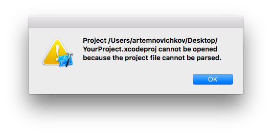

<p align="center">

</p>

<p align="center">
  <a href="https://swift.org/package-manager">
    
  </a>
  <a href="https://github.com/JohnSundell/Marathon">
    
  </a>
</p>

Do you use [Carthage](https://github.com/Carthage/Carthage)? Are you feel tired of adding special script and the paths to frameworks (point 4, 5 and 6 in [Getting Started guide](https://github.com/Carthage/Carthage#getting-started)) manually? Me too. Carting do it for you. It scans Carthage folder and linked frameworks, gets framework names and updates the script.

## Using

Run `carting` in project folder. That's all.

By default Carting searches a script named `Carthage`, but you can set a name of your script via command line arguments:

```
$ carting MyBestScript
```

If there is no script with the name, Carting will add a new one.

**🚨Note**: be sure to have no uncommitted changes in project file to prevent project parsing errors 😱.


## Installing

### Make:

```
$ git clone https://github.com/artemnovichkov/carting.git
$ cd Carting
$ make
```

### Swift Package Manager:

```
$ git clone https://github.com/artemnovichkov/carting.git
$ cd Carting
$ swift build -c release -Xswiftc -static-stdlib
$ cp -f .build/release/Carting /usr/local/bin/carting
```
### Marathon

- Install [Marathon](https://github.com/johnsundell/marathon#installing).
- Add Carting to Marathon using `$ marathon add git@github.com:artemnovichkov/carting.git`. Alternatively, add `git@github.com:artemnovichkov/carting.git` to your `Marathonfile`.
- Write your script, then run it using `$ marathon run <path-to-your-script>`.

## Todo
 - [x] Add option for adding new script
 - [x] Add support of multiple targets
 - [x] Add check of linked frameworks
 - [x] Add option for platform selection or automatic check
 - [ ] Unify errors
 - [ ] Write tests

## Author

Artem Novichkov, novichkoff93@gmail.com

## License

Carting is available under the MIT license. See the LICENSE file for more info.

