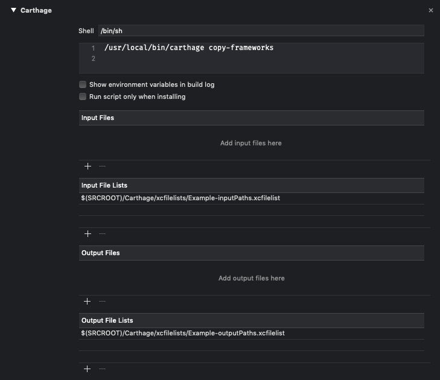
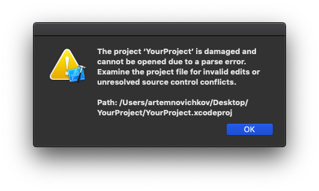

<p align="center">
  
</p>


<p align="center">
	<a href="https://travis-ci.org/artemnovichkov/Carting">
        
    
  <a href="https://swift.org/package-manager">
    
  </a>
  <a href="https://github.com/JohnSundell/Marathon">
    
  </a>
</p>

Do you use [Carthage](https://github.com/Carthage/Carthage)? Are you feel tired of adding special script and the paths to frameworks (point 4, 5 and 6 in [Getting Started guide](https://github.com/Carthage/Carthage#getting-started)) manually? Me too. Carting does it for you. It scans Carthage folder and linked frameworks, gets framework names and updates the script.

<p align="center">
  
</p>


## Using

Run `carting update` in project folder. That's all.

By default Carting searches a script named `Carthage`, but you can set a name of your script via command line arguments:

```
$ carting update -s MyBestScript
```

If there is no script with the name, Carting will add a new one.

Since Xcode 10 Run Script build phases support declaring input and output files in a `.xcfilelist` file. This file should contain a newline-seperated list of the file paths for the inputs or outputs. Carting uses it by default. If you need to work with your projects in old Xcode versions, use `-f file` option.

**🚨Note**: be sure to have no uncommitted changes in project file to prevent project parsing errors 😱.

<p align="center">
  
</p>

Run `carting help` to see available commands:

```bash
Usage: carting [command] [options]
  update:
      Adds a new script with input/output file paths or updates the script named `Carthage`.
  -s, --script:
      The name of Carthage script.
  -p, --path:
      The project directory path.
  -f, --format:
      Format of input/output file paths - using simple paths or xcfilelists.
  info:
      Prints Carthage frameworks list with linking description.
  help:
      Prints this message.
```

## Installing

### Homebrew (recommended):

```bash
$ brew install artemnovichkov/projects/carting
```

### [Mint](https://github.com/yonaskolb/Mint):

```bash
$ mint run artemnovichkov/Carting
```

### Make:

```bash
$ git clone https://github.com/artemnovichkov/carting.git
$ cd Carting
$ make
```

### Swift Package Manager:

```swift
let package = Package(
    dependencies: [
        .Package(url: "https://github.com/artemnovichkov/carting", majorVersion: 1)
    ]
)
```
### Marathon

- Install [Marathon](https://github.com/johnsundell/marathon#installing).
- Add Carting to Marathon using `$ marathon add git@github.com:artemnovichkov/carting.git`. Alternatively, add `git@github.com:artemnovichkov/carting.git` to your `Marathonfile`.
- Write your script, then run it using `$ marathon run <path-to-your-script>`.

## Todo
 - [x] Add option for adding new script
 - [x] Add support of multiple targets
 - [x] Add check of linked frameworks
 - [x] Unify errors
 - [ ] Add support of tvOS and watchOS platforms
 - [ ] Check correct work with workspaces
 - [ ] Write tests

## Author

Artem Novichkov, novichkoff93@gmail.com

## License

Carting is available under the MIT license. See the LICENSE file for more info.

